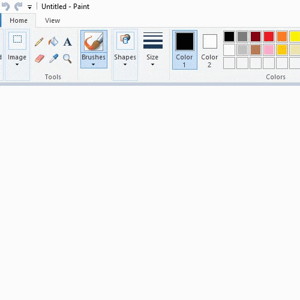

# **Bob_Ross** 
#### Program python yang akan melukiskan ulang gambar mu di Microsoft Paint

## 1. Code and Files

#### Beberapa penjelasan

* [bobross.py](bobross.py) Script utama
* [Examples](Examples) folder berisi contoh hasil
* [Images](Images) folder berisi gambar yang akan dilukis ulang
* [Templates](Templates) folder berisi template gambar yang akan didetect oleh [bobross.py](bobross.py) pada Microsoft Paint

#### Beberapa penjelasan code pada script
* Mulai Microsoft Paint menggunakan CMD
```sh
os.system("Start /max mspaint")
```
* Set posisi mouse
```sh
mouse.position = START_POS
```
* Mencocokkan gambar template edit button
```sh
res = cv2.matchTemplate(img, edit_colors_button, cv2.TM_SQDIFF)
min_val, max_val, min_loc, max_loc = cv2.minMaxLoc(res)
top_left = min_loc
bottom_right = (top_left[0] + w, top_left[1] + h)
```
* Hitung kordinat pusat button
```sh
center = ((top_left[0] + bottom_right[0]) / 2, (top_left[1] + bottom_right[1]) / 2)
```


## 2. Dependencies

#### Saya menggunakan Visual Studio Code sebagai editor

* Python3.7, OpenCV3, pyinput dan pillow 
* OS: Windows 10

## 3. How To Run

#### If you want to run the demo, you can simply run:
```sh
python bobross.py
```
## 4. Hasil

#### Berikut hasil ketika program dijalankan


